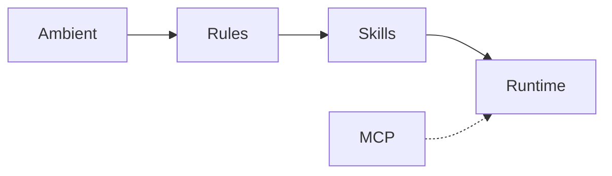

# Agent Harness 소개

이 하네스의 **개념 입구** (레이어·왜 쓰나·명령 요약).  
**학습은 루트 [README.md](../../README.md)에서 시작**하고, 읽기 순서는 [getting-started.md](./getting-started.md)를 따른다.

---

## 한 줄 정의

> Cursor에게 **누가·무엇을·어떤 순서로·어떤 검증 후** 일할지 알려 주고, 스크립트와 CI로 강제하는 **운영 하네스**.

앱 스타터가 아님 · 에이전트 플랫폼도 아님 · `sample/`은 TB-101 연습용 mock.

---

## 왜 쓰나

| 없을 때 | 이 하네스 |
|---------|-----------|
| main 직접 커밋·범위 밖 수정 | 브랜치·역할·범위 |
| API/UI 따로 놀음 | Contract → BE/FE + handoff |
| “테스트 했다”만 말함 | `run-eval` · CI |
| 규칙이 README만 | Rules + Skills + **자동 검증** |

---

## 하루 흐름 (예: TB-101)

TB-101을 맡으면: `todo.md`에 등록하고 `feature/TB-101-user-list` 브랜치를 연다. Contract 역할이 handoff를 고정하고 `validate-handoff`를 통과한다. Backend·Frontend를 병렬로 구현한 뒤 `run-eval`을 돌린다. PR 전 `validate-harness -Pr`과 eval 요약을 붙이고 CI가 green이면 no-ff로 머지한다.

---

## 구조 (3세대)

> 1·2세대가 뭔지, 왜 “3세대”인지: [evolution.md](./evolution.md)



| 레이어 | 역할 | 위치 |
|--------|------|------|
| Ambient | 짧은 계약 | `AGENTS.md`, `playbook.md` |
| Rules | 역할·경로 | `.cursor/rules/*.mdc` |
| Skills | PR·dispatch 등 **절차** | `.cursor/skills/*` |
| Runtime | **강제** 검증 | `scripts/`, CI |
| MCP | live API (선택) | `mcp-setup.md` |

다른 문서에 레이어 표를 **반복하지 않음** — 여기만 상세.

---

## 역할·워크플로

```text
todo → worktree/브랜치 → Contract → BE/FE(병렬) → QA → PR → CI → merge
```

태그: `[TB-101][Backend]` · 브랜치: `feature/TB-101-short-name`  
용어: [glossary.md](./glossary.md)

---

## 명령 (외울 것만)

**매 티켓:** `dispatch-prompt` · `run-eval`  
**PR 직전:** `validate-harness -Pr` · `summarize-eval -OutFile …`  
전체 목록: [scripts-reference.md](./scripts-reference.md) · Eval 구분: [eval-guide.md](./eval-guide.md)

---

## Skills — 언제 쓰나

| Skill | 호출 시점 |
|-------|-----------|
| worktree-setup | 병렬 티켓 착수 |
| dispatch | 역할별 서브에이전트 분리 |
| contract-handoff | Contract 산출 후 |
| backend-test-gate | server/api 변경 후 |
| pr-workflow | PR 직전 |
| harness-gate | validate 실패 시 체크리스트 |

---

## 채택 3단계

**신규 프로젝트 경로(A/B)부터:** [how-to-use.md](./how-to-use.md)

1. [TEMPLATE.md](./TEMPLATE.md) — 붙이기  
2. `AGENTS.md` · globs · `run-eval` — 맞추기  
3. githooks · CI · branch protection — 게이트  

첫 연습: [first-ticket.md](./first-ticket.md) · 스택: [presets/](./presets/)

---

## 검증 한눈에

| 게이트 | 시점 |
|--------|------|
| `validate-harness` | 커밋·CI |
| `run-eval` | 티켓·CI (앱 + harness-smoke) |
| `validate-harness -Pr` | PR (브랜치·todo·커밋·dispatch) |

실패 시: [playbook.md](./playbook.md) **실패 시** · 로그 예: `FAIL: validate-todo-sync — TB-102 가 todo.md에 없음`

---

## 문서 맵

| 대상 | 문서 |
|------|------|
| **학습 시작 (저장소 입구)** | 루트 `README.md` → `getting-started.md` |
| **개념 (레이어 표는 여기만)** | `introduction.md` |
| 세대·진화 | `evolution.md` |
| 신규 프로젝트 How to use | `how-to-use.md` |
| 빈 폴더 Bootstrap 프롬프트 | `bootstrap-prompts.md` |
| 채택 체크리스트 | `TEMPLATE.md` |
| 첫 연습 | `first-ticket.md` |
| 에이전트 | `AGENTS.md` → `playbook.md` (필요 섹션) |
| Eval | `eval-guide.md` |
| 확장 | `extending.md` |

허브: [getting-started.md](./getting-started.md) · 인덱스: [README.md](./README.md)

---

## FAQ

**clone 후 Bootstrap 프롬프트를 또 붙여?** — 아니요. clone/템플릿이면 [how-to-use.md](./how-to-use.md) **경로 A**. Bootstrap은 빈 폴더(**경로 B**)용.  
**Cursor 없이?** — 브랜치·handoff·스크립트 게이트는 사람에게도 유효.  
**스크립트 많음?** — Daily/PR 4개면 됨. 나머지는 CI·`-Pr`.  
**LLM CI 회귀?** — 정적·fixture까지 자동. 실제 LLM 세션은 [eval-guide.md](./eval-guide.md) (선택).

문의: `CONTRIBUTING.md`
