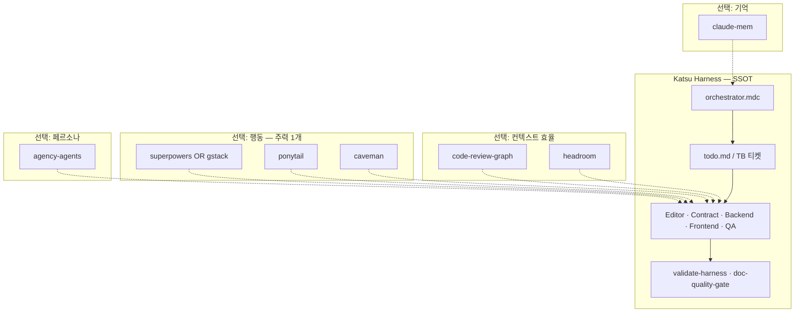

# 서드파티 에이전트·스킬 통합

외부 오픈소스 플러그인·스킬·MCP를 **Katsu 하네스**와 함께 쓸 때의 개요, 레이어 배치, 충돌 회피, 채택 절차를 정리합니다.

**전제:** 본 스타터는 **문서 전용** 하네스입니다. 오케스트레이터(`.cursor/rules/orchestrator.mdc`) → `todo.md` 티켓 → `[TB-xxx][Role]` 디스패치가 SSOT입니다. 서드파티는 **보완 레이어**로만 추가합니다.

관련 문서:

- [customization.md](./customization.md) — 풀스택 확장
- [mcp-setup.md](./mcp-setup.md) — MCP 등록
- [extending.md](./extending.md) — CI·eval 확장
- [alignment-log.md](./alignment-log.md) — 팀 채택 기록

---

## 한눈에 보기

| 프로젝트 | 유형 | 하는 일 | Cursor 지원 |
|----------|------|---------|-------------|
| [superpowers](https://github.com/obra/superpowers) | 스킬 프레임워크 + SDLC | 설계 → 계획 → TDD → 서브에이전트 구현 → 리뷰 | 플러그인 (`/add-plugin superpowers`) |
| [gstack](https://github.com/garrytan/gstack) | 스프린트 스킬 세트 | `/office-hours`, `/ship`, `/review`, `/qa`, 브라우저 QA | `./setup --host cursor` |
| [agency-agents](https://github.com/msitarzewski/agency-agents) | 에이전트 페르소나 | Frontend Developer, Backend Architect 등 100+ 역할 프롬프트 | `install.sh --tool cursor` |
| [claude-mem](https://github.com/thedotmack/claude-mem) | 세션 간 메모리 | 관찰 캡처 → AI 압축 → 다음 세션 주입, MCP 검색 | `cursor-hooks/` + worker |
| [caveman](https://github.com/juliusbrussee/caveman) | 출력 토큰 압축 스킬 | 응답 prose 단축 (~65% 출력 절감), 코드·에러는 보존 | `npx skills add ... -a cursor` |
| [headroom](https://github.com/headroomlabs-ai/headroom) | 입력 컨텍스트 압축 | 도구 출력·로그·파일을 LLM 전에 압축 | 프록시 / MCP (수동 설정) |
| [code-review-graph](https://github.com/tirth8205/code-review-graph) | 코드 지능 그래프 (MCP) | blast radius, 리뷰 최소 컨텍스트 | `install --platform cursor` |
| [ponytail](https://github.com/DietrichGebert/ponytail) | YAGNI / 최소 코드 스킬 | 불필요한 코드·의존성 제거 | `.cursor/rules/` 복사 |

---

## 레이어 모델

하네스 코어는 유지하고, 서드파티는 **아래 레이어**에만 올립니다.



| 레이어 | 대표 도구 | 하네스와의 관계 |
|--------|-----------|-----------------|
| **A — 인프라** | claude-mem, code-review-graph, headroom | 오케스트레이션 변경 없음. MCP·훅만 추가 |
| **B — 행동 (주력 1개)** | superpowers **또는** gstack | 워크플로 중복 — 우선순위를 문서화해야 함 |
| **C — 토큰/코드 효율** | ponytail, caveman | 병행 가능. Editor 문서 티켓은 caveman off 권장 |
| **D — 페르소나** | agency-agents | `.mdc` 역할 **대체 금지**. dispatch 힌트로만 사용 |

---

## 프로젝트별 상세

### Superpowers

- **정체:** composable skills + 강제 SDLC (brainstorming, writing-plans, subagent-driven-development, TDD 등).
- **설치 (Cursor):** Agent 채팅에서 `/add-plugin superpowers` 또는 마켓플레이스 검색.
- **하네스 적용:** TB 티켓 **DoD 확정 전** brainstorming·writing-plans만 허용. 구현 dispatch는 `[TB-xxx][Role]`이 SSOT.
- **충돌:** Superpowers의 subagent-driven-development와 하네스 `dispatch` 스킬이 **동시에** 서브에이전트를 띄울 수 있음 → orchestrator에 “Superpowers executing-plans는 하네스 dispatch와 **택일**” 명시.

### gstack

- **정체:** 1인 빌더용 스프린트 스킬 (`/office-hours`, `/autoplan`, `/review`, `/ship`, `/qa`, 브라우저·iOS QA 등).
- **설치 (Cursor):**

  ```bash
  git clone --single-branch --depth 1 https://github.com/garrytan/gstack.git ~/.cursor/skills/gstack
  cd ~/.cursor/skills/gstack && ./setup --host cursor
  ```

- **하네스 적용:** **문서 전용** 단계에선 ROI 낮음. [customization.md](./customization.md) 풀스택 확장 후, 배포·E2E QA 티켓에만 gstack 파이프 사용.
- **충돌:** gstack checkpoint `WIP:` 커밋 vs 하네스 `feature/TB-*` + no-ff. `/ship` squash 정책을 팀 규칙과 맞출 것.

### Agency Agents

- **정체:** engineering / design / marketing 등 **분야별 전문가** 마크다운 에이전트.
- **설치:**

  ```bash
  git clone https://github.com/msitarzewski/agency-agents.git
  cd agency-agents
  ./scripts/install.sh --tool cursor --agent technical-writer,qa-engineer
  ```

- **하네스 적용:** Editor·QA 등 **역할과 겹치는 페르소나만** subset 설치. `.mdc` glob·범위는 변경하지 않음.
- **OpenCode 주의:** upstream 한도(~119 agents) — 필요 division만 설치.

### Claude-mem

- **정체:** lifecycle hooks + worker + SQLite/Chroma. 세션 간 compressed memory.
- **설치:**

  ```bash
  npx claude-mem install
  ```

  Cursor: upstream `cursor-hooks/` 참고해 `~/.cursor/hooks.json` 연동.

- **하네스 적용:**
  - **공식 기록:** `todo.md`, handoff, PR — 하네스 SSOT
  - **비공식 관찰:** claude-mem (결정 배경·디버깅 맥뽁)
- **MCP:** `search` → `timeline` → `get_observations` 3단계 (토큰 절약 패턴).

### Caveman

- **정체:** 에이전트 **출력** prose 압축. 코드·명령·에러는 byte-preserving.
- **설치:**

  ```bash
  npx skills add JuliusBrussee/caveman -a cursor
  ```

- **하네스 적용:** Backend/Frontend 구현·QA 리뷰에 유리. **Editor 문서 작성** 티켓은 `off` 또는 `lite`.
- **주의:** 스킬 자체가 turn당 ~1–1.5k input 추가. 짧은 작업에선 net-negative 가능.

### Headroom

- **정체:** tool output / JSON / 로그 / RAG **입력** 압축. CCR로 원본 복원 가능.
- **설치:**

  ```bash
  pip install "headroom-ai[all]"
  headroom doctor
  ```

  Cursor: [공식 문서](https://headroom-docs.vercel.app/docs/proxy) — proxy + MCP 수동 설정 (`headroom wrap`은 Cursor **Manual setup**).

- **하네스 적용:** doc-only에선 필수 아님. 모노레포·대형 grep/로그 작업 시 레이어 A.
- **Caveman과 구분:** Headroom = **읽는 양**, Caveman = **말하는 양**.

### code-review-graph

- **정체:** Tree-sitter 코드 그래프 → blast radius → MCP로 **읽을 파일만** 선택.
- **설치:**

  ```bash
  pip install code-review-graph
  code-review-graph install --platform cursor
  code-review-graph build
  ```

- **하네스 적용:** Contract·QA 역할, PR 직전 review. [mcp-setup.md](./mcp-setup.md) 패턴으로 `.cursor/mcp.json` 등록 (비커밋).
- **CI (선택):** upstream GitHub Action — PR sticky comment, `fail-on-risk` merge gate.

### Ponytail

- **정체:** YAGNI 사다리 — stdlib → native → 1줄 → 최소 구현. `/ponytail-review`, `/ponytail-audit`.
- **설치 (Cursor):** upstream `.cursor/rules/`를 프로젝트 `.cursor/rules/`에 복사, 또는 플러그인 마켓플레이스.
- **하네스 적용:** orchestrator “토큰 효율” 원칙과 정합. Superpowers TDD와 **공존** (테스트 유지, 구현 최소화).

---

## 하네스 역할별 추천

| 하네스 역할 | 추천 | 비고 |
|-------------|------|------|
| **Orchestrator** | claude-mem | TB·브랜치 맥락 |
| **Editor** | (caveman off) | prose 품질 우선 |
| **Contract** | code-review-graph | 스키마·API 변경 blast radius |
| **Backend / Frontend** | ponytail + code-review-graph | 풀스택 확장 후 |
| **QA** | code-review-graph, Superpowers `requesting-code-review`, 또는 gstack `/review` | doc-only: 전자 위주 |

---

## 충돌 회피 체크리스트

| 조합 | 위험 | 완화 |
|------|------|------|
| Superpowers + Katsu orchestrator | 이중 계획·이중 dispatch | TB DoD = 하네스; Superpowers는 설계·TDD **절**만 |
| gstack + harness playbook | 커밋·브랜치 규칙 불일치 | gstack을 “배포 티켓 전용”으로 스코프 |
| Caveman + Editor | 문서 품질 저하 | 역할·티켓별 caveman off |
| agency-agents + `.mdc` | glob·범위 drift | `.mdc` SSOT, agency는 톤 힌트만 |
| Headroom + CRG + Caveman | input overhead | 단계적 채택; `headroom perf`로 측정 |

---

## 채택 절차

1. **팀 결정:** 레이어 A~D 중 무엇을 켤지 (행동 레이어 B는 **1개** 권장).
2. **설치:** upstream README 따름. MCP는 [mcp-setup.md](./mcp-setup.md).
3. **orchestrator 보강 (필요 시):** 우선순위·스코프 3~5줄만 `.cursor/rules/orchestrator.mdc` 또는 `AGENTS.md`에 추가. playbook 전체 중복 금지.
4. **기록:** [alignment-log.md](./alignment-log.md)에 채택 목록·결정·날짜.
5. **검증:**

   ```bash
   ./scripts/doc-quality-gate.sh
   pwsh scripts/validate-harness.ps1
   ```

   풀스택 + CRG: `code-review-graph detect-changes --brief`로 그래프 동작 확인.

---

## 단계별 최소 추천

### 문서 전용 (현재 스타터)

| 순서 | 도구 | 이유 |
|------|------|------|
| 1 | claude-mem | 세션·티켓 맥락 |
| 2 | Superpowers **또는** ponytail | 워크플로 vs 코드 최소화 중 택1 |
| 3 | — | gstack / CRG / Headroom은 보류 |

### 풀스택 확장 후 ([customization.md](./customization.md))

| 순서 | 도구 | 이유 |
|------|------|------|
| 4 | code-review-graph | 리뷰·탐색 토큰 |
| 5 | headroom | 대형 repo tool output |
| 6 | gstack | `/qa`, `/ship`, 브라우저 QA |

---

## MCP 등록 예시 (code-review-graph)

`.cursor/mcp.json`은 **커밋하지 않음**. [mcp-setup.md](./mcp-setup.md) §1 참고.

```json
{
  "mcpServers": {
    "code-review-graph": {
      "command": "code-review-graph",
      "args": ["serve"]
    }
  }
}
```

토큰 제한 환경에서는 upstream `CRG_TOOLS` 또는 `--tools`로 서브셋만 노출.

---

## AGENTS.md 기록 예시

채택 후 프로젝트 `AGENTS.md`에 선택 절 추가:

```markdown
## 서드파티 (팀 채택)

| 도구 | 레이어 | 용도 |
|------|--------|------|
| claude-mem | A | 세션 간 관찰 |
| ponytail | C | Backend/Frontend 최소 구현 |
| code-review-graph | A | QA·Contract 리뷰 MCP |

우선순위: TB 티켓·`.mdc` > Superpowers brainstorming > ponytail ladder.
```

---

## 참고 링크

| 저장소 | 문서 |
|--------|------|
| superpowers | https://github.com/obra/superpowers |
| gstack | https://github.com/garrytan/gstack |
| agency-agents | https://github.com/msitarzewski/agency-agents |
| claude-mem | https://github.com/thedotmack/claude-mem |
| caveman | https://github.com/juliusbrussee/caveman |
| headroom | https://headroom-docs.vercel.app/docs |
| code-review-graph | https://code-review-graph.com |
| ponytail | https://ponytail.dev |
